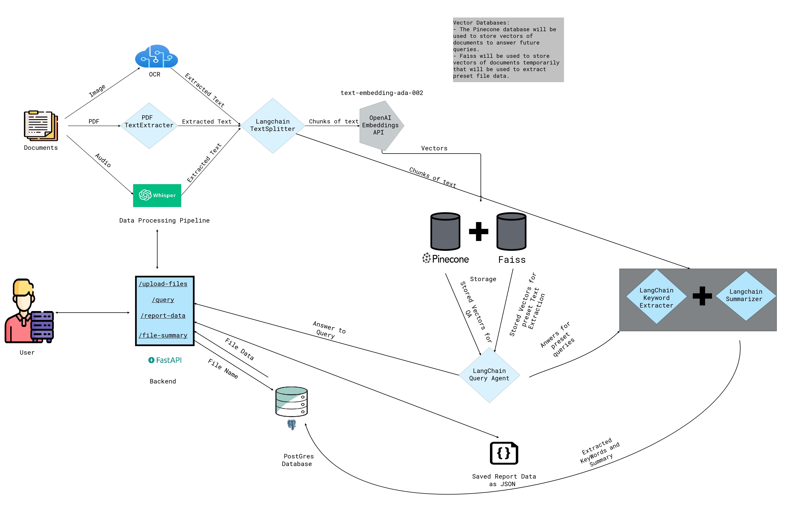

# Leveraging LangChain and Large Language Models for Accurate PDF-Based Question Answering



This repo is to help you build a powerful question answering system that can accurately answer questions by combining [Langchain](https://github.com/hwchase17/langchain) and large language models (LLMs) including OpenAI's GPT3.5 turbo model.

The image shows the architechture of the system and you can change the code based on your needs. The main components of this code:

- **Backend:** It has been written in Python using FastAPI framework and does the following:

  - handles all the requests coming from client side.
  - creates the _data processing pipeline_. It converts PDF documents to text and split them to smaller chuncks. You can use it for other document types, thanks to langchain for providng the `data loaders`. Backend also handles the embedding part. It initializes the _embedding model_. I have used text-embedding-ada-002 of openAI to make it **faster**. You can use OpenAI embeddings or other ones. I have used [Pinecone](https://www.pinecone.io/) cloud (free tier) to host my embeddings and textual documents for fast search and retrieval. It can be replaced by other _vector-based_ databases such as Qdrant, Weaviate, Elasticsearch, etc., either on the cloud or _mostly locally_ hosted, depending on the vendor.

- **Frontend:** is developed using React/Typescript.

## Quick start

After getting your keys, you have to create a `.env` file in `backend/app` directory with the following information:

```python
OPENAI_API_KEY=
AZURE_VISION_ENDPOINT=
AZURE_VISION_KEY=
AZ_SPEECH_KEY=
AZ_SPEECH_REGION=
PINECONE_API_KEY=
PINECONE_ENV=
```

Clone the repo:

`git clone https://github.com/nishantsinha00/drqa.git`

Running the frontend is very straightforward. You simply go to the `frontend` directory and run:

```bash
npm install
npm start
```

For running the backend, first create a virtual environment using python 3.8, install ffmpeg in the environment and then from `backend/app` directory run:

Installing ffmpeg
- Ubuntu
```bash
apt-get -y update && apt-get -y upgrade && apt-get install -y --no-install-recommends ffmpeg
```

- Windows</br>
Check this [documentation](https://phoenixnap.com/kb/ffmpeg-windows)

- MacOs
```bash
brew update
brew upgrade
brew install ffmpeg
```
Installing python packages and running the app
```bash
pip install -r requirements.txt
python main.py
```

## Advantages

This repo can be used as a general guide line for how to combine your own data with LLMs with other frameworks like Langchain, [LlamaIndex](https://github.com/jerryjliu/llama_index). Also, since it only uses OpenAI for final response generation, it reduces the API call cost significantly.

## Future improvements

- Streaming feature: The client will get the stream of response as soon as it becomes available.
- Cache: Adding cache could make the system much more efficient. For similar or repeatitive questions, you don't need to generate response/call API as they are stored in the cache
- UI: Rewriting the UI for better user experience
- Adding different types of documents for question-answering. Currently, you can only use it for PDF files.
- Adding memory for long conversations and summarization
- and many more!

## Discussion and Contribution

If you have any comment or feedback, please don't hesitate to use the `Discussions` section and open a new topic. You can also reach out directly via [Linkedin](https://www.linkedin.com/in/mehdiallahyari/) or [Twitter](https://twitter.com/MehdiAllahyari)
